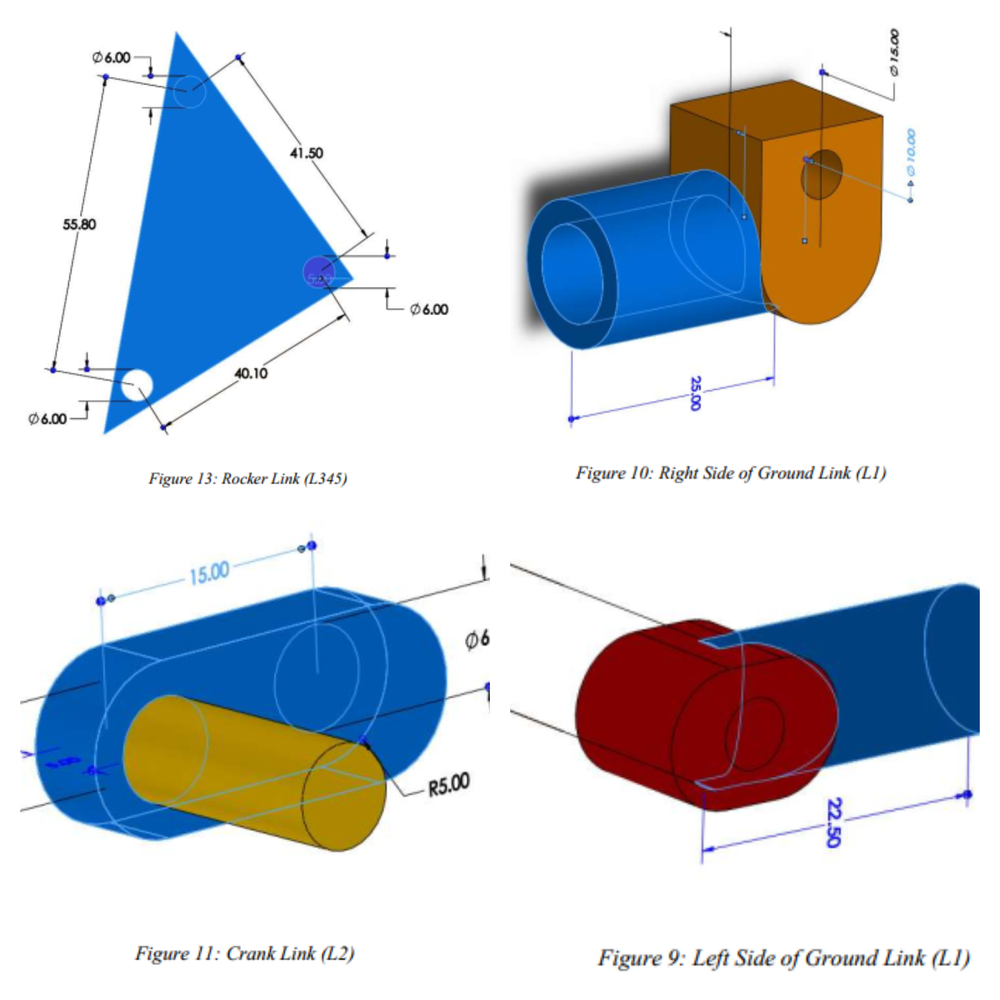
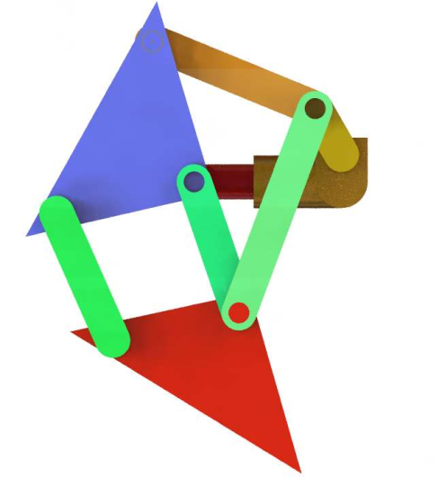
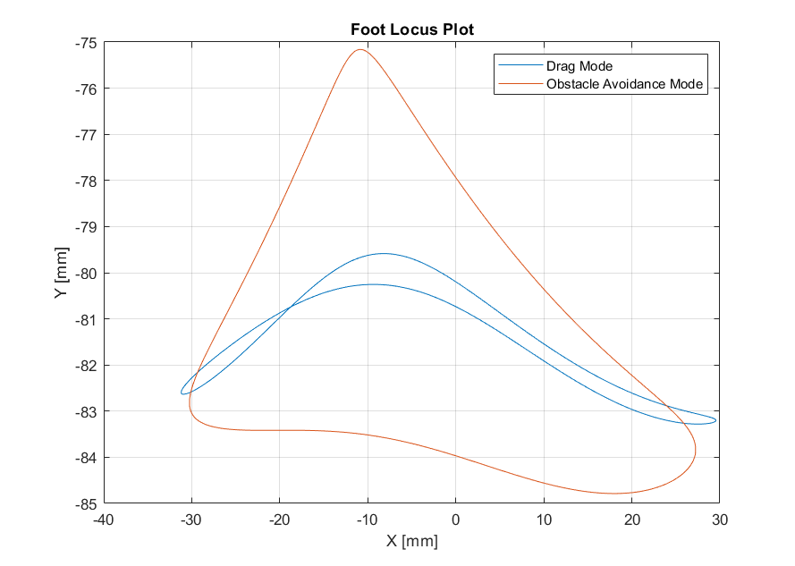
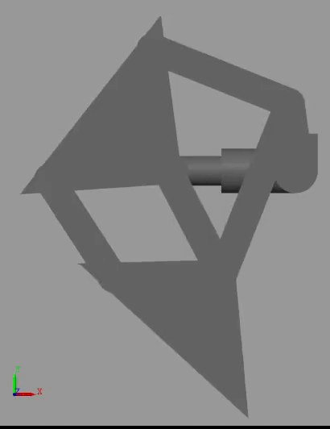
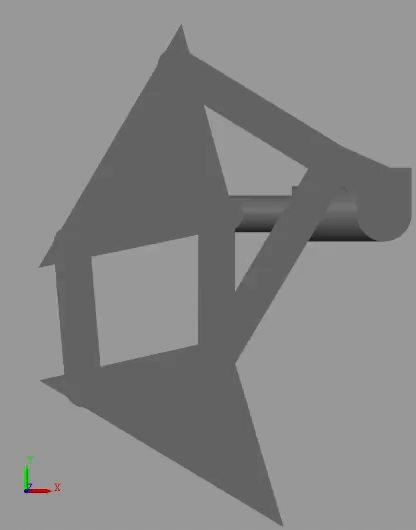

# Design and Analysis of a Modified Theo-Jansen Mechanism for walking purposes

<p>Obstacle avoidance is an important aspect in robotics and mechatronics applications. Wheeled robots
are commonly used for locomotion and carrying payloads from one point to another. However, they
can get trapped in hard and uneven terrains and thereby, a walking mechanism can be employed instead.
Walking mechanisms include bipedal mechanism, quad legged robots and even 6 legged robots. A
walking mechanism has the ability to overcome large obstacles and can also carry large payload in drag
mode. In this report, a modified Theo Jansen mechanism is proposed to address the problem of obstacle
avoidance. After brainstorming different design ideas, a modification in the ground link is proposed.
The modified Theo Jansen mechanism consists of an adjustable ground link by employing the use of a
slider joint instead of a rigid link. By modifying the length of the ground link, the locus of the leg can
be changed during the operation of the mechanism. In this way, the robot can be operated in two modes:
the drag mode for maximum payload capacity and the stride mode for avoiding obstacles of different
heights. The modification in the ground link assures design robustness and stability since the ground
link does not have any moving parts. A CAD model is developed in SOLIDWORKS while the
kinematic and dynamic modeling is done in SIMULINK. The mechanism is verified for the range of
motion proposed while other performance parameters including the crank torque, slider force and
transmission angles are also evaluated</p>

## CAD Model

### Individual Links
</img>

### Final Assembly
</img>


## How to run? 
<p>Open MATLAB and run the following script</p>

```
run PostProcessing_v2.mlx
```
<p>To view the Simulink model, open:</p>

```
walkingMechanism_model_v2.slx
```

## Trajectory Graph

</img>


## Simulation Drag Mode
</img>

## Simulation Obstacle Avoidance Mode
</img>